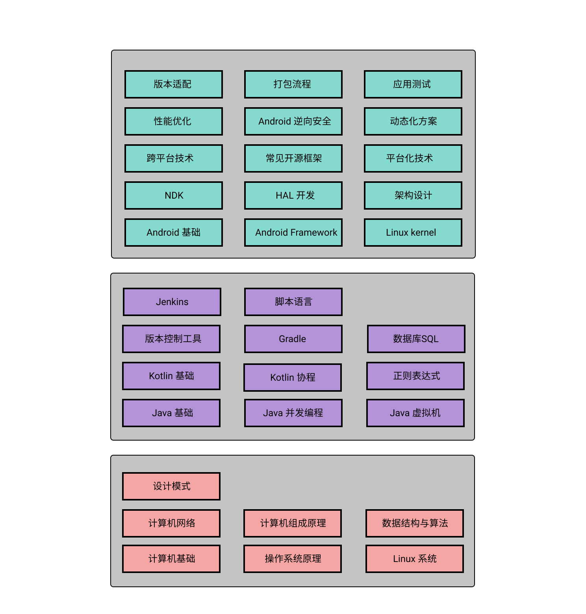

  
  
  
  

----------------

每工作日更新一道 Android 面试题，小聚成河，大聚成江，坚持下来的都是时代的铸就者，共勉之！如果想要和我们一起坚持下去，不妨点个**关注**吧！:rainbow_flag:

## Android 知识图谱

## 后续计划

- 面试题收集
- 往期面试题分类整理
- 提供[往期面试题索引](https://github.com/Moosphan/Android-Daily-Interview/blob/master/android-interview/interivew-history.md)
- 维护人员招募
- 每期面试题的解析归纳
- GitBook 的编纂

> 近期将每日一题任务**暂时**关闭，后续将集中精力去提升本项目的质量和完善题解，感谢大家一直以来的支持，继续无畏前行💪

## 如何贡献？

想加入这件有意义的事，并成为[**贡献者**](https://github.com/Moosphan/Android-Daily-Interview/blob/HEAD/android-interview/contributors.md)一员？很简单，你可以选择以下方式来完善和壮大这个项目：

1. 参与每日答题，在[**答题区**](https://github.com/Moosphan/Android-Daily-Interview/issues)留下你的见解，让更多人认识你！
2. 参与[**往期面试题的归纳、总结、完善或者扩展**](https://github.com/Moosphan/Android-Daily-Interview/issues/113)，稳固基石！
3. 前往👉[**后续面试题征集区域**](https://github.com/Moosphan/Android-Daily-Interview/issues/20)，提供更多优质面试题～
4. 你也可以加入QQ群，参与本项目的维护或者讨论：**713463651**

## 面试题分类汇总

以下主要针对往期收录的面试题进行一个分类归纳整理，方便大家统一回顾和参考。

### Java 方面

Java 常见考察知识点可大致分为以下几部分：

#### Java 基础部分

- [抽象类与接口的区别？](https://github.com/Moosphan/Android-Daily-Interview/issues/10)

- [分别讲讲 final、static 和 synchronized 可以修饰什么，以及修饰后的作用？](https://github.com/Moosphan/Android-Daily-Interview/issues/61)
- [请简述一下 String、StringBuffer 和 StringBuilder 三者的区别？](https://github.com/Moosphan/Android-Daily-Interview/issues/22)
- [“equals” 与 “==”、“hashCode” 的区别和使用场景？](https://github.com/Moosphan/Android-Daily-Interview/issues/51)
- [Java 中深拷贝与浅拷贝的区别？](https://github.com/Moosphan/Android-Daily-Interview/issues/75)
- [谈谈 Error 和 Exception 的区别？](https://github.com/Moosphan/Android-Daily-Interview/issues/68)
- [什么是反射机制？反射机制的应用场景有哪些？](https://github.com/Moosphan/Android-Daily-Interview/issues/65)
- [谈谈如何重写 equals() 方法？为什么还要重写 hashCode()？](https://github.com/Moosphan/Android-Daily-Interview/issues/77)
- [Java 中 IO 流分为几种？它们之间有什么区别？](https://github.com/Moosphan/Android-Daily-Interview/issues/82)
- [谈谈你对 Java 泛型中类型擦除的理解，并说说其局限性？](https://github.com/Moosphan/Android-Daily-Interview/issues/118)
- [String 为什么要设计成不可变的？](https://github.com/Moosphan/Android-Daily-Interview/issues/153)
- [说说你对 Java 注解的理解？](https://github.com/Moosphan/Android-Daily-Interview/issues/162)
- [谈一谈 Java 成员变量、局部变量和静态变量的创建和回收时机？](https://github.com/Moosphan/Android-Daily-Interview/issues/215)
- [请说说 Java 中 String.length() 的运作原理？](https://github.com/Moosphan/Android-Daily-Interview/issues/229)

#### Java 集合

- [谈谈 Java 中 List、Set 以及 Map 的区别？](https://github.com/Moosphan/Android-Daily-Interview/issues/120)

- [谈谈 ArrayList 和 LinkedList 的区别？](https://github.com/Moosphan/Android-Daily-Interview/issues/36)
- [请说一下 HashMap 与 HashTable 的区别？](https://github.com/Moosphan/Android-Daily-Interview/issues/39)
- [说一说 ArrayList 的扩容机制？](https://github.com/Moosphan/Android-Daily-Interview/issues/64)
- [HashMap 的实现原理？](https://github.com/Moosphan/Android-Daily-Interview/issues/16)
- [请简述 LinkedHashMap 的工作原理和使用场景？](https://github.com/Moosphan/Android-Daily-Interview/issues/45)
- [谈谈对于 ConcurrentHashMap 的理解？](https://github.com/Moosphan/Android-Daily-Interview/issues/74)

#### Java 多线程

- [Java 中使用多线程的方式有哪些？](https://github.com/Moosphan/Android-Daily-Interview/issues/66)
- [说一下线程的几种状态？](https://github.com/Moosphan/Android-Daily-Interview/issues/99)

- [如何实现多线程中的同步？](https://github.com/Moosphan/Android-Daily-Interview/issues/6)
- [谈谈线程死锁，如何有效的避免线程死锁？](https://github.com/Moosphan/Android-Daily-Interview/issues/43)
- [谈谈线程阻塞的原因？](https://github.com/Moosphan/Android-Daily-Interview/issues/63)
- [请谈谈 Thread 中 run() 与 start() 方法的区别？](https://github.com/Moosphan/Android-Daily-Interview/issues/69)
- [说一下 synchronized 和 volatile 关键字的区别？](https://github.com/Moosphan/Android-Daily-Interview/issues/55)
- [如何保证线程安全？](https://github.com/Moosphan/Android-Daily-Interview/issues/108)
- [谈谈 ThreadLocal 用法和原理？](https://github.com/Moosphan/Android-Daily-Interview/issues/83)
- [谈谈 Java 线程中 notify 和 notifyAll 方法有什么区别？](https://github.com/Moosphan/Android-Daily-Interview/issues/104)
- [什么是线程池？如何创建一个线程池？](https://github.com/Moosphan/Android-Daily-Interview/issues/106)
- [谈一谈 Java 中几种常见锁以及它们的使用场景？](https://github.com/Moosphan/Android-Daily-Interview/issues/110)
- [谈一谈线程 sleep() 和 wait() 方法的区别？](https://github.com/Moosphan/Android-Daily-Interview/issues/117)
- [什么是悲观锁和乐观锁？](https://github.com/Moosphan/Android-Daily-Interview/issues/133)
- [什么是 BlockingQueue？请分析一下其内部原理并谈谈它的使用场景？](https://github.com/Moosphan/Android-Daily-Interview/issues/194)
- [谈一谈 Java 线程安全的集合有哪些？各有什么特点？](https://github.com/Moosphan/Android-Daily-Interview/issues/208)
- [Java 中为什么会出现 Atomic 类？试分析它的原理和缺点？](https://github.com/Moosphan/Android-Daily-Interview/issues/237)
- [说说 ThreadLocal 的使用场景？与 Synchronized 相比有什么特性？](https://github.com/Moosphan/Android-Daily-Interview/issues/238)

#### Java 虚拟机

- [请简要谈一谈 Java 中的垃圾回收机制？](https://github.com/Moosphan/Android-Daily-Interview/issues/46)

- [回答一下什么是强、软、弱、虚引用以及它们之间的区别？](https://github.com/Moosphan/Android-Daily-Interview/issues/27)

- [简述 JVM 中类的加载机制与加载过程？](https://github.com/Moosphan/Android-Daily-Interview/issues/44)
- [JVM、Dalvik、ART 三者的原理和区别？](https://github.com/Moosphan/Android-Daily-Interview/issues/84)

- [请谈谈 Java 的内存回收机制？](https://github.com/Moosphan/Android-Daily-Interview/issues/141)
- [什么是 JMM？它存在哪些问题？该如何解决？](https://github.com/Moosphan/Android-Daily-Interview/issues/240)

### Android 方面

Android 考察点比较纷杂，以下针对之前收录的面试题做一个大概的划分：

#### Android 四大组件相关

- [Activity 与 Fragment 之间常见的几种通信方式？](https://github.com/Moosphan/Android-Daily-Interview/issues/2)
- [谈谈 Android 中几种 LaunchMode 的特点和应用场景？](https://github.com/Moosphan/Android-Daily-Interview/issues/4)
- [BroadcastReceiver 与 LocalBroadcastReceiver 有什么区别？](https://github.com/Moosphan/Android-Daily-Interview/issues/11)
- [对于 Context，你了解多少?](https://github.com/Moosphan/Android-Daily-Interview/issues/14)
- [IntentFilter 是什么？有哪些使用场景？匹配机制是怎样的？](https://github.com/Moosphan/Android-Daily-Interview/issues/26)
- [谈一谈 startService 和 bindService 方法的区别，生命周期以及使用场景？](https://github.com/Moosphan/Android-Daily-Interview/issues/53)
- [Service 如何进行保活？](https://github.com/Moosphan/Android-Daily-Interview/issues/98)
- [简单介绍下 ContentProvider 是如何实现数据共享的？](https://github.com/Moosphan/Android-Daily-Interview/issues/100)
- [说下切换横竖屏时 Activity 的生命周期变化？](https://github.com/Moosphan/Android-Daily-Interview/issues/115)
- [Activity 中 onNewIntent 方法的调用时机和使用场景？](https://github.com/Moosphan/Android-Daily-Interview/issues/138)
- [Intent 传输数据的大小有限制吗？如何解决？](https://github.com/Moosphan/Android-Daily-Interview/issues/151)
- [说说 ContentProvider、ContentResolver、ContentObserver 之间的关系？](https://github.com/Moosphan/Android-Daily-Interview/issues/155)
- [说说 Activity 加载的流程？](https://github.com/Moosphan/Android-Daily-Interview/issues/168)

#### Android 异步任务和消息机制

- [HandlerThread 的使用场景和实现原理？](https://github.com/Moosphan/Android-Daily-Interview/issues/37)

- [IntentService 的应用场景和内部实现原理？](https://github.com/Moosphan/Android-Daily-Interview/issues/25)
- [AsyncTask 的优点和缺点？内部实现原理是怎样的？](https://github.com/Moosphan/Android-Daily-Interview/issues/28)
- [谈谈你对 Activity.runOnUiThread 的理解？](https://github.com/Moosphan/Android-Daily-Interview/issues/49)
- [Android 的子线程能否做到更新 UI？](https://github.com/Moosphan/Android-Daily-Interview/issues/91)
- [谈谈 Android 中消息机制和原理？](https://github.com/Moosphan/Android-Daily-Interview/issues/9)
- [为什么在子线程中创建 Handler 会抛异常？](https://github.com/Moosphan/Android-Daily-Interview/issues/93)
- [试从源码角度分析 Handler 的 post 和 sendMessage 方法的区别和应用场景？](https://github.com/Moosphan/Android-Daily-Interview/issues/239)
- [Handler 中有 Loop 死循环，为什么没有阻塞主线程，原理是什么？](https://github.com/Moosphan/Android-Daily-Interview/issues/170)

#### Android UI 绘制相关

此类主要涵盖 Android 的 View 绘制过程、常见 UI 组件、自定义 View、动画等。

- [Android 补间动画和属性动画的区别？](https://github.com/Moosphan/Android-Daily-Interview/issues/7)
- [Window 和 DecorView 是什么？DecorView 又是如何和 Window 建立联系的?](https://github.com/Moosphan/Android-Daily-Interview/issues/13)
- [简述一下 Android 中 UI 的刷新机制？](https://github.com/Moosphan/Android-Daily-Interview/issues/17)
- [你认为 LinearLayout、FrameLayout 和 RelativeLayout 哪个效率高, 为什么？](https://github.com/Moosphan/Android-Daily-Interview/issues/30)
- [说一下 Android 中的事件分发机制？](https://github.com/Moosphan/Android-Daily-Interview/issues/35)
- [谈谈自定义 View 的流程？](https://github.com/Moosphan/Android-Daily-Interview/issues/41)
- [有针对 RecyclerView 做过哪些优化？](https://github.com/Moosphan/Android-Daily-Interview/issues/38)
- [谈谈你是如何优化 ListView 的？](https://github.com/Moosphan/Android-Daily-Interview/issues/42)
- [谈一谈自定义 RecyclerView.LayoutManager 的流程？](https://github.com/Moosphan/Android-Daily-Interview/issues/47)
- [什么是 RemoteViews？使用场景有哪些？](https://github.com/Moosphan/Android-Daily-Interview/issues/62)
- [谈一谈获取View宽高的几种方法？](https://github.com/Moosphan/Android-Daily-Interview/issues/131)
- [View.post() 为什么可以获取到宽高信息？](https://github.com/Moosphan/Android-Daily-Interview/issues/126)
- [谈一谈属性动画的插值器和估值器？](https://github.com/Moosphan/Android-Daily-Interview/issues/148)
- [getDimension、getDimensionPixelOffset 和 getDimensionPixelSize 三者的区别？](https://github.com/Moosphan/Android-Daily-Interview/issues/156)
- [请谈谈源码中 StaticLayout 的用法和应用场景？](https://github.com/Moosphan/Android-Daily-Interview/issues/174)
- [有用过ConstraintLayout吗？它有哪些特点？](https://github.com/Moosphan/Android-Daily-Interview/issues/175)
- [关于LayoutInflater，它是如何通过 inflate 方法获取到具体View的？](https://github.com/Moosphan/Android-Daily-Interview/issues/177)
- [谈一谈如何实现 Fragment 懒加载？](https://github.com/Moosphan/Android-Daily-Interview/issues/178)
- [谈谈  RecyclerView的缓存机制？](https://github.com/Moosphan/Android-Daily-Interview/issues/181)
- [请说说 View.inflate 和 LayoutInflater.inflate 的区别？](https://github.com/Moosphan/Android-Daily-Interview/issues/185)
- [请谈谈 invalidate() 和 postInvalidate() 方法的区别和应用场景？](https://github.com/Moosphan/Android-Daily-Interview/issues/186)
- [~~谈一谈自定义View和ViewGroup的流程以及区别？~~](https://github.com/Moosphan/Android-Daily-Interview/issues/191)
- [谈一谈 SurfaceView 与 TextureView 的使用场景和用法？](https://github.com/Moosphan/Android-Daily-Interview/issues/199)
- [谈一谈 RecyclerView.Adapter 的几种数据刷新方式有何不同？](https://github.com/Moosphan/Android-Daily-Interview/issues/202)
- [说说你对 Window 和 WindowManager 的理解？](https://github.com/Moosphan/Android-Daily-Interview/issues/203)
- [谈一谈 Activity、View 和 Window 三者的关系？](https://github.com/Moosphan/Android-Daily-Interview/issues/213)
- [有了解过WindowInsets吗？它有哪些应用场景？](https://github.com/Moosphan/Android-Daily-Interview/issues/216)
- [Android 中 View 的几种位移方式的区别？](https://github.com/Moosphan/Android-Daily-Interview/issues/220)
- [为什么 ViewPager 嵌套 ViewPager，内部的 ViewPager 滚动没有被拦截？](https://github.com/Moosphan/Android-Daily-Interview/issues/235)
- [请谈谈 Fragment 的生命周期？](https://github.com/Moosphan/Android-Daily-Interview/issues/161)
- [请谈谈什么是同步屏障？](https://github.com/Moosphan/Android-Daily-Interview/issues/171)
- [有了解过 ViewDragHelper 的工作原理吗？](https://github.com/Moosphan/Android-Daily-Interview/issues/204)
- [~~谈一谈Android的屏幕刷新机制？~~](https://github.com/Moosphan/Android-Daily-Interview/issues/210)

#### Android 性能调优相关

- [谈谈你对Android性能优化方面的了解？](https://github.com/Moosphan/Android-Daily-Interview/issues/58)

- [一般什么情况下会导致内存泄漏问题？如何解决](https://github.com/Moosphan/Android-Daily-Interview/issues/3)

- [自定义 Handler 时如何有效地避免内存泄漏问题？](https://github.com/Moosphan/Android-Daily-Interview/issues/1)
- [哪些情况下会导致OOM问题？如何解决？](https://github.com/Moosphan/Android-Daily-Interview/issues/5)
- [ANR 出现的场景以及解决方案？](https://github.com/Moosphan/Android-Daily-Interview/issues/8)
- [谈谈 Android 中内存优化的方式？](https://github.com/Moosphan/Android-Daily-Interview/issues/18)
- [谈谈布局优化的技巧？](https://github.com/Moosphan/Android-Daily-Interview/issues/95)
- [对于 Android 中图片资源的优化方案你知道哪些？](https://github.com/Moosphan/Android-Daily-Interview/issues/70)
- [Android Native Crash 问题如何分析定位？](https://github.com/Moosphan/Android-Daily-Interview/issues/88)
- [该如何给 Apk 瘦身？](https://github.com/Moosphan/Android-Daily-Interview/issues/80)
- [说一下你是如何优化 App 启动过程的？](https://github.com/Moosphan/Android-Daily-Interview/issues/85)
- [谈谈代码混淆的步骤？](https://github.com/Moosphan/Android-Daily-Interview/issues/109)
- [说说 App 的电量优化？](https://github.com/Moosphan/Android-Daily-Interview/issues/102)
- [谈谈如何对 WebView 进行优化？](https://github.com/Moosphan/Android-Daily-Interview/issues/123)
- [如何处理大图的加载？](https://github.com/Moosphan/Android-Daily-Interview/issues/111)
- [谈谈如何对网络请求进行优化？](https://github.com/Moosphan/Android-Daily-Interview/issues/114)
- [请谈谈如何加载Bitmap并防止内存溢出？](https://github.com/Moosphan/Android-Daily-Interview/issues/207)

#### Android 中的 IPC

- [请回答一下 Android 中进程间通信有哪些方式？](https://github.com/Moosphan/Android-Daily-Interview/issues/21)
- [请谈谈你对 Binder 机制的理解？](https://github.com/Moosphan/Android-Daily-Interview/issues/105)
- [什么是 AIDL？它的使用场景是什么？](https://github.com/Moosphan/Android-Daily-Interview/issues/119)

#### Android 系统 SDK 相关

- [请简要谈谈 Android 系统的架构组成？](https://github.com/Moosphan/Android-Daily-Interview/issues/149)

- [SharedPreferences 是线程安全的吗？它的 commit 和 apply 方法有什么区别？](https://github.com/Moosphan/Android-Daily-Interview/issues/15)
- [Serializable 和 Parcelable 有哪些区别？](https://github.com/Moosphan/Android-Daily-Interview/issues/19)
- [请说一下 Android 7.0 的新特性？](https://github.com/Moosphan/Android-Daily-Interview/issues/31)
- [谈谈 ArrayMap 和 HashMap 的区别？](https://github.com/Moosphan/Android-Daily-Interview/issues/54)
- [简要说说 LruCache 的原理？](https://github.com/Moosphan/Android-Daily-Interview/issues/79)
- [Android 中为什么推荐用 SparseArray 代替 HashMap？](https://github.com/Moosphan/Android-Daily-Interview/issues/130)
- [PathClassLoader 和 DexClassLoader 有何区别？](https://github.com/Moosphan/Android-Daily-Interview/issues/163)
- [说说 HttpClient 与 HttpUrlConnection 的区别？为何前者会被替代？](https://github.com/Moosphan/Android-Daily-Interview/issues/221)
- [什么是Lifecycle？请分析其内部原理和使用场景？](https://github.com/Moosphan/Android-Daily-Interview/issues/222)
- [谈一谈 Android 的签名机制？不同版本下的签名有什么不同？](https://github.com/Moosphan/Android-Daily-Interview/issues/187)
- [谈谈安卓 Apk 构建的流程？](https://github.com/Moosphan/Android-Daily-Interview/issues/150)
- [简述一下 Android 8.0、9.0 分别增加了哪些新特性？](https://github.com/Moosphan/Android-Daily-Interview/issues/87)
- [谈谈 Android 10 更新了哪些内容？如何进行适配?](https://github.com/Moosphan/Android-Daily-Interview/issues/145)
- [请简述 Apk 的安装过程？](https://github.com/Moosphan/Android-Daily-Interview/issues/157)
- [Java 与 JS 代码如何互调？有做过相关优化吗？](https://github.com/Moosphan/Android-Daily-Interview/issues/166)
- [什么是 JNI？具体说说如何实现 Java 与 C++ 的互调？](https://github.com/Moosphan/Android-Daily-Interview/issues/142)
- [请谈谈 App 的启动流程？](https://github.com/Moosphan/Android-Daily-Interview/issues/24)

#### 第三方框架分析

- [谈一谈 LeakCanray 的工作原理？](https://github.com/Moosphan/Android-Daily-Interview/issues/160)
- [说说 EventBus 的实现原理？](https://github.com/Moosphan/Android-Daily-Interview/issues/176)
- [谈谈网络请求中的拦截器 - Interceptor 的实现原理和使用场景？](https://github.com/Moosphan/Android-Daily-Interview/issues/193)
- [谈一谈 Glide 中的缓存机制？](https://github.com/Moosphan/Android-Daily-Interview/issues/197)
- [ViewModel 的出现是为了解决什么问题？并简要说说它的内部原理？](https://github.com/Moosphan/Android-Daily-Interview/issues/205)
- [请说说依赖注入框架 ButterKnife 的实现原理？](https://github.com/Moosphan/Android-Daily-Interview/issues/211)
- [谈一谈 RxJava 背压原理？](https://github.com/Moosphan/Android-Daily-Interview/issues/228)

#### 综合技术

- [请谈谈你对 MVC 和 MVP 的理解？](https://github.com/Moosphan/Android-Daily-Interview/issues/33)
- [分别介绍下你所知道的 Android 中几种存储方式？](https://github.com/Moosphan/Android-Daily-Interview/issues/57)
- [简述下热修复的原理？](https://github.com/Moosphan/Android-Daily-Interview/issues/73)
- [谈谈你是如何适配更多机型的？](https://github.com/Moosphan/Android-Daily-Interview/issues/92)
- [请谈谈你是如何进行多渠道打包的？](https://github.com/Moosphan/Android-Daily-Interview/issues/132)
- [MVP 中你是如何处理 Presenter 层以防止内存泄漏的？](https://github.com/Moosphan/Android-Daily-Interview/issues/139)
- [如何计算一张图片所占的内存空间大小？](https://github.com/Moosphan/Android-Daily-Interview/issues/144)
- [有没有遇到 64k 问题，应该如何解决？](https://github.com/Moosphan/Android-Daily-Interview/issues/152)
- [如何优化 Gradle 的构建速度？](https://github.com/Moosphan/Android-Daily-Interview/issues/154)
- [如何获取 Android 设备唯一 ID？](https://github.com/Moosphan/Android-Daily-Interview/issues/159)
- [谈一谈 Android P 禁用 HTTP 协议对我们开发有什么影响？](https://github.com/Moosphan/Android-Daily-Interview/issues/173)
- [什么是 AOP？在 Android 中它有哪些应用场景？](https://github.com/Moosphan/Android-Daily-Interview/issues/179)
- [什么是 MVVM？你是如何将其应用于具体项目中的？](https://github.com/Moosphan/Android-Daily-Interview/issues/182)
- [请谈谈你会如何实现数据埋点？](https://github.com/Moosphan/Android-Daily-Interview/issues/184)
- [假如让你实现断点上传功能，你认为应该怎样去做？](https://github.com/Moosphan/Android-Daily-Interview/issues/192)
- [webp 和 svg 格式的图片各自有什么特点？应该如何在 Android 中使用？](https://github.com/Moosphan/Android-Daily-Interview/issues/200)
- [说说你是如何进行单元测试的？以及如何应用在 MVP 和 MVVM 中？](https://github.com/Moosphan/Android-Daily-Interview/issues/212)
- [如何绕过 Android 9.0 针对反射的限制？](https://github.com/Moosphan/Android-Daily-Interview/issues/214)
- [对于 GIF 格式的图片加载有什么思路和建议？](https://github.com/Moosphan/Android-Daily-Interview/issues/219)
- [为什么要将项目迁移到 AndroidX？如何进行迁移？](https://github.com/Moosphan/Android-Daily-Interview/issues/232)
- [~~你了解过哪些Android屏幕适配方面的技巧？~~](https://github.com/Moosphan/Android-Daily-Interview/issues/234)

### 数据结构方面

- [什么是冒泡排序？如何去优化？](https://github.com/Moosphan/Android-Daily-Interview/issues/56)

- [请用 Java 实现一个简单的单链表？](https://github.com/Moosphan/Android-Daily-Interview/issues/59)
- [如何反转一个单链表？](https://github.com/Moosphan/Android-Daily-Interview/issues/89)
- [谈谈你对时间复杂度和空间复杂度的理解？](https://github.com/Moosphan/Android-Daily-Interview/issues/97)
- [谈一谈如何判断一个链表有环？](https://github.com/Moosphan/Android-Daily-Interview/issues/122)
- [~~手写二叉树结构？~~](https://github.com/Moosphan/Android-Daily-Interview/issues/125)
- [什么是红黑树？为什么要用红黑树？](https://github.com/Moosphan/Android-Daily-Interview/issues/147)
- [什么是快速排序？如何优化？](https://github.com/Moosphan/Android-Daily-Interview/issues/167)
- [说说循环队列？它有哪些应用场景？](https://github.com/Moosphan/Android-Daily-Interview/issues/189)
- [如何判断单链表交叉？](https://github.com/Moosphan/Android-Daily-Interview/issues/230)

### 设计模式

- [请简要谈一谈单例模式？](https://github.com/Moosphan/Android-Daily-Interview/issues/12)

- [对于面向对象的六大基本原则了解多少？](https://github.com/Moosphan/Android-Daily-Interview/issues/29)

- [请列出几种常见的工厂模式并说明它们的用法？](https://github.com/Moosphan/Android-Daily-Interview/issues/50)

- [说说项目中用到的设计模式和使用场景？](https://github.com/Moosphan/Android-Daily-Interview/issues/72)

- [什么是代理模式？如何使用？Android源码中的代理模式？](https://github.com/Moosphan/Android-Daily-Interview/issues/81)
- [谈一谈单例模式，建造者模式，工厂模式的使用场景？如何合理选择？](https://github.com/Moosphan/Android-Daily-Interview/issues/86)
- [谈谈你对原型模式的理解？](https://github.com/Moosphan/Android-Daily-Interview/issues/121)
- [请谈谈策略模式原理及其应用场景？](https://github.com/Moosphan/Android-Daily-Interview/issues/143)
- [静态代理和动态代理的区别，什么场景使用？](https://github.com/Moosphan/Android-Daily-Interview/issues/165)
- [谈一谈责任链模式的使用场景？](https://github.com/Moosphan/Android-Daily-Interview/issues/183)

### 计算机网络方面

- [请简述 Http 与 Https 的区别？](https://github.com/Moosphan/Android-Daily-Interview/issues/71)
- [说一说 HTTPS、UDP、Socket 之间的区别？](https://github.com/Moosphan/Android-Daily-Interview/issues/78)

- [请简述一次 HTTP 网络请求的过程？](https://github.com/Moosphan/Android-Daily-Interview/issues/94)
- [谈一谈 TCP/IP 三次握手、四次挥手过程？](https://github.com/Moosphan/Android-Daily-Interview/issues/129)
- [为什么说Http是可靠的数据传输协议？](https://github.com/Moosphan/Android-Daily-Interview/issues/218)
- [TCP/IP 协议分为哪几层？TCP 和 HTTP 分别属于哪一层？](https://github.com/Moosphan/Android-Daily-Interview/issues/223)
- [Post 中请求参数放在了哪个位置？](https://github.com/Moosphan/Android-Daily-Interview/issues/226)

### Kotlin 方面

- [请简述一下什么是 Kotlin？它有哪些特性？](https://github.com/Moosphan/Android-Daily-Interview/issues/67)
- [Kotlin 中注解 @JvmOverloads 的作用？](https://github.com/Moosphan/Android-Daily-Interview/issues/76)
- [Kotlin 中 List 与 MutableList 的区别？](https://github.com/Moosphan/Android-Daily-Interview/issues/90)
- [Kotlin 中实现单例的几种常见方式？](https://github.com/Moosphan/Android-Daily-Interview/issues/96)
- [谈谈你对 Kotlin 中的 data 关键字的理解？相比于普通类有哪些特点？](https://github.com/Moosphan/Android-Daily-Interview/issues/101)
- [什么是委托属性？请简要说说其使用场景和原理？](https://github.com/Moosphan/Android-Daily-Interview/issues/107)
- [请举例说明 Kotlin 中 with 与 apply 函数的应用场景和区别？](https://github.com/Moosphan/Android-Daily-Interview/issues/116)
- [Kotlin中 Unit 类型的作用以及与Java中 Void 的区别？](https://github.com/Moosphan/Android-Daily-Interview/issues/124)
- [Kotlin 中 infix 关键字的原理和使用场景？](https://github.com/Moosphan/Android-Daily-Interview/issues/128)
- [Kotlin中的可见性修饰符有哪些？相比于 Java 有什么区别？](https://github.com/Moosphan/Android-Daily-Interview/issues/140)
- [你觉得 Kotlin 与 Java 混合开发时需要注意哪些问题？](https://github.com/Moosphan/Android-Daily-Interview/issues/146)
- [在 Kotlin 中，何为解构？该如何使用？](https://github.com/Moosphan/Android-Daily-Interview/issues/164)
- [在 Kotlin 中，什么是内联函数？有什么作用？](https://github.com/Moosphan/Android-Daily-Interview/issues/169)
- [谈谈Kotlin中的构造方法？有哪些注意事项？](https://github.com/Moosphan/Android-Daily-Interview/issues/180)
- [谈谈 Kotlin 中的 Sequence，为什么它处理集合操作更加高效？](https://github.com/Moosphan/Android-Daily-Interview/issues/188)
- [请谈谈 Kotlin 中的 Coroutines，它与线程有什么区别？有哪些优点？](https://github.com/Moosphan/Android-Daily-Interview/issues/190)
- [~~Kotlin中可见型修饰符有哪些？相比于Java有什么区别？~~](https://github.com/Moosphan/Android-Daily-Interview/issues/196)
- [~~谈谈Kotlin中的Unit？它和Java中的void有什么区别？~~](https://github.com/Moosphan/Android-Daily-Interview/issues/198)
- [Kotlin中该如何安全地处理可空类型？](https://github.com/Moosphan/Android-Daily-Interview/issues/201)
- [说说 Kotlin中 的 Any 与Java中的 Object 有何异同？](https://github.com/Moosphan/Android-Daily-Interview/issues/209)
- [Kotlin中的数据类型有隐式转换吗？为什么？](https://github.com/Moosphan/Android-Daily-Interview/issues/217)
- [分别通过对象表达式 object 和 lambda 表达式实现的函数式接口内部有何不同？](https://github.com/Moosphan/Android-Daily-Interview/issues/224)
- [Kotlin 中集合遍历有哪几种方式？](https://github.com/Moosphan/Android-Daily-Interview/issues/231)
- [为什么协程比线程要轻量？](https://github.com/Moosphan/Android-Daily-Interview/issues/233)

### 开放性问题

- [你知道哪些提升开发效率的骚操作？](https://github.com/Moosphan/Android-Daily-Interview/issues/112)
- [在开发过程中你遇到过的最大的难题是什么？如何解决的？](https://github.com/Moosphan/Android-Daily-Interview/issues/227)
- [说说你未来的职业规划是怎样的？](https://github.com/Moosphan/Android-Daily-Interview/issues/236)
- [你是如何看待 Flutter，React Native 与 Android 关系的？](https://github.com/Moosphan/Android-Daily-Interview/issues/158)

## Thanks

> 感谢 [**玩 Android**](https://www.wanandroid.com) 为广大安卓开发者无私提供一个比较全面的 Android 学习平台，此项目部分灵感亦来源于此。

## 最后

> 建立这个项目的初衷是想大家每天以**答题打卡**的方式来巩固基础知识和查漏补缺。我相信，如果每天能够坚持打卡，不出一个月定能意识到自己的成长。因此，对于想要和我们一样坚持的同学，欢迎来加群探讨，群号**713463651**，请特别备注：**坚持打卡**。

